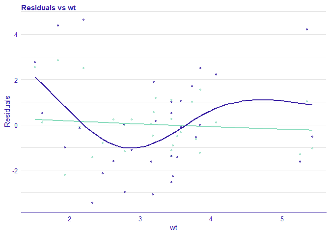

# The auditor package - model verification, validation, and error analysis


[](https://cran.r-project.org/package=auditor)

[](https://travis-ci.org/MI2DataLab/auditor)
[](https://codecov.io/github/mi2datalab/auditor?branch=master)

Package `auditor` is a tool for model-agnostic validation. Implemented
techniques facilitate assessing and comparing the goodness of fit and
performance of models. In addition, they may be used for the analysis of
the similarity of residuals and for the identification of outliers and
influential observations. The examination is carried out by diagnostic
scores and visual verification. Due to the flexible and consistent
grammar, it is simple to validate models of any classes.

auditor’s pipeline: *model %\>% audit() %\>% plot(type=…)*


## Installation

Stable version from CRAN:

``` r
install.packages("auditor")
```

Developer version from GitHub:

``` r
source("https://install-github.me/agosiewska/auditor")
```

## DEMO

Run the code below or try the auditor.

``` r
library(auditor)
library(randomForest)
data(mtcars)

# fitting models
model_lm <- lm(mpg ~ ., data = mtcars)
set.seed(123)
model_rf <- randomForest(mpg ~ ., data = mtcars)

# creating a modelAudit object which contains all necessary components required for further processing
au_lm <- audit(model_lm)
au_rf <- audit(model_rf, label = "rf")

# generating plots
plotResidual(au_lm, au_rf, variable = "wt", lines = TRUE)
```

<!-- -->

## More

  - [News](NEWS.md)

  - [Reference Manual](https://mi2datalab.github.io/auditor/)

  - Cheatsheets
    
      - [Error analysis with
        auditor](https://raw.githubusercontent.com/mi2datalab/auditor/master/materials/auditor_cheatsheet.png)
      - [ROC plots with
        auditor](https://raw.githubusercontent.com/mi2datalab/auditor/master/materials/auditor_cheatsheet_ROC.png)

  - A [preprint of the article about
    auditor](https://arxiv.org/abs/1809.07763) is available on arxiv.

  - Acknowledgments: Work on this package was financially supported by
    the ‘NCN Opus grant
2016/21/B/ST6/02176’.

### A Short Overview of Plots

| Plot name                                             | Function                                                              | Regression | Classification | Examples                                                                                                                                                          |
| ----------------------------------------------------- | --------------------------------------------------------------------- | ---------- | -------------- | ----------------------------------------------------------------------------------------------------------------------------------------------------------------- |
| Autocorrelation Function                              | `plotACF()` </br> `plot(..., type = "ACF")`                           | yes        | yes            | [Examples](https://mi2datalab.github.io/auditor/articles/model_residuals_audit.html#plotacf---autocorrelation-function-of-residuals)                              |
| Autocorrelation                                       | `plotAutocorrelation()` </br> `plot(..., type = "Autocorrelation")`   | yes        | yes            | [Examples](https://mi2datalab.github.io/auditor/articles/model_residuals_audit.html#plotautocorrelation---autocorrelation-of-residuals)                           |
| Influence of observations                             | `plotCooksDistance()` </br> `plot(..., type = "CooksDistance")`       | yes        | yes            | [Examples](https://mi2datalab.github.io/auditor/articles/observation_influence_audit.html#which-observations-are-outlyers)                                        |
| Half-Normal                                           | `plotHalfNormal()` </br> `plot(..., type = "HalfNormal")`             | yes        | yes            | [Examples](https://mi2datalab.github.io/auditor/articles/model_fit_audit.html)                                                                                    |
| LIFT Chart                                            | `plotLIFT()` </br> `plot(..., type = "LIFT")`                         | no         | yes            | [Examples](https://mi2datalab.github.io/auditor/articles/model_evaluation_audit.html#lift-chart)                                                                  |
| Model Correlation                                     | `plotModelCorrelation()` </br> `plot(..., type = "ModelCorrelation")` | yes        | yes            | [Examples](https://mi2datalab.github.io/auditor/articles/model_residuals_audit.html#plotmodelcorrelation---correlation-of-models)                                 |
| Principal Component Analysis of models                | `plotModelPCA()` </br> `plot(..., type = "ModelPCA")`                 | yes        | yes            | [Examples](https://mi2datalab.github.io/auditor/articles/model_residuals_audit.html#plotmodelpca---model-pca)                                                     |
| Model Ranking Plot                                    | `plotModelRanking()` </br> `plot(..., type = "ModelRanking")`         | yes        | yes            | [Examples](https://mi2datalab.github.io/auditor/articles/model_performance_audit.html)                                                                            |
| Predicted Response vs Observed or Variable Values     | `plotPrediction()` </br> `plot(..., type = "Prediction")`             | yes        | yes            | [Examples](https://mi2datalab.github.io/auditor/articles/model_residuals_audit.html#plotpredition---observed-vs-predicted)                                        |
| Regression Error Characteristic Curves (REC)          | `plotREC()` </br> `plot(..., type = "REC")`                           | yes        | yes            | [Examples](https://mi2datalab.github.io/auditor/articles/model_residuals_audit.html#plotrec---regression-error-characteristic-rec-curve)                          |
| Plot Residuals vs Observed, Fitted or Variable Values | `plotResidual()` </br> `plot(..., type = "Residual")`                 | yes        | yes            | [Examples](https://mi2datalab.github.io/auditor/articles/model_residuals_audit.html#plotresidual---plot-residuals-vs-observed-fitted-or-variable-values)          |
| Residual Boxplot                                      | `plotResidualBoxplot()` </br> `plot(..., type = "ResidualBoxplot")`   | yes        | yes            | [Examples](https://mi2datalab.github.io/auditor/articles/model_residuals_audit.html#plotresidualboxplot---boxplot-of-residuals)                                   |
| Residual Density                                      | `plotResidualDensity()` </br> `plot(..., type = "ResidualDensity")`   | yes        | yes            | [Examples](https://mi2datalab.github.io/auditor/articles/model_residuals_audit.html#plotresidualdensity---density-of-residuals)                                   |
| Receiver Operating Characteristic (ROC)               | `plotROC()` </br> `plot(..., type = "ROC")`                           | no         | yes            | [Examples](https://mi2datalab.github.io/auditor/articles/model_evaluation_audit.html#receiver-operating-characteristic-roc)                                       |
| Regression Receiver Operating Characteristic (RROC)   | `plotRROC()` </br> `plot(..., type = "RROC")`                         | yes        | yes            | [Examples](https://mi2datalab.github.io/auditor/articles/model_residuals_audit.html#plotrroc---regression-receiver-operating-characteristic-rroc)                 |
| Scale-Location plot                                   | `plotScaleLocation()` </br> `plot(..., type = "ScaleLocation")`       | yes        | yes            | [Examples](https://mi2datalab.github.io/auditor/articles/model_residuals_audit.html#plotscalelocation---scale-location-plot)                                      |
| Two-sided Cumulative Distribution Function            | `plotTwoSidedECDF()` </br> `plot(..., type = "TwoSidedECDF")`         | yes        | yes            | [Examples](https://mi2datalab.github.io/auditor/articles/model_residuals_audit.html#plottwosidedecdf---two-sided-empirical-cumulative-distribution-function-ecdf) |
